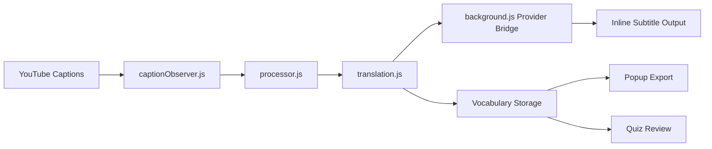
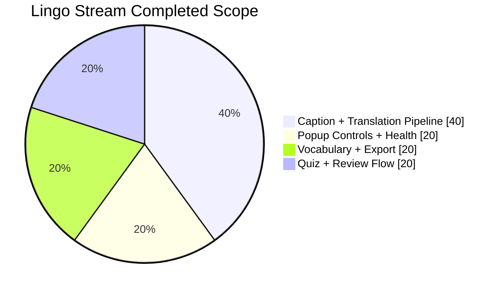

<table align="center">
   <tr>
      <td valign="middle">
         
      </td>
      <td valign="middle">
         <h1>Lingo Stream</h1>
         <p>Ambient language learning directly inside YouTube subtitles.</p>
      </td>
      <td valign="middle">
         
      </td>
   </tr>
</table>

<p align="center">
   <a href="#quick-pitch">Quick Pitch</a> |
   <a href="#overview">Overview</a> |
   <a href="#current-status">Status</a> |
   <a href="#key-features">Key Features</a> |
   <a href="#architecture">Architecture</a> |
   <a href="#technical-approach">Technical Approach</a> |
   <a href="#providers-and-languages">Providers & Languages</a> |
   <a href="#installation">Install</a> |
   <a href="#usage">Usage</a> |
   <a href="#development">Development</a> |
   <a href="#testing">Testing</a> |
   <a href="#limitations">Limitations</a> |
   <a href="#data-and-privacy">Privacy</a> |
   <a href="#roadmap">Roadmap</a> |
   <a href="#contributors">Contributors</a> |
   <a href="#contribution">Contribution</a>
</p>

<p align="center">
   
   
   
   
   
</p>

> [!TIP]
> Quick pitch for judges: Lingo Stream turns passive subtitle watching into low-friction vocabulary training without forcing users to leave YouTube.

## Overview

Lingo Stream is a Chrome Extension (Manifest V3) that injects micro-immersion into live YouTube captions by replacing a small percentage of meaningful words with inline translations.

```text
Original: I really enjoy learning new skills every day.
Lingo Stream: I really enjoy (gusto) learning new skills every day.
```

> [!NOTE]
> Design principle: do not translate everything. Keep context readable, then reinforce vocabulary over repeated exposure.

## Current Status

- Core extension runtime implemented
- Popup settings and health diagnostics implemented
- Vocabulary tracking + CSV export implemented
- Quiz review mode implemented
- Automated lint/test/build scripts implemented

Release:

- v1.0.0 (Full-Release)
- Download: [Lingo.Stream.1.0.0.Release.zip](https://github.com/UnoxyRich/Lingo-Stream/releases/download/Full-Release/Lingo.Stream.1.0.0.Release.zip)

## Key Features

- Observes YouTube subtitle updates in real time
- Filters low-value tokens (stopwords, very short tokens, numbers)
- Replaces configurable percentage of words inline
- Uses provider fallback strategy (`auto` mode)
- Caches translation hits/misses to reduce repeat requests
- Saves optional vocabulary entries and exports CSV
- Includes review quiz with fast, score-tracked rounds
- **Interface language selector** — choose from 50+ languages to translate the popup and quiz UI itself (Settings → Interface Language)

> [!WARNING]
> Public translation providers can throttle or become temporarily unavailable; provider fallback helps but cannot fully eliminate third-party instability.

## Architecture

### Feature Flow



### Completed Scope



## Technical Approach

### Tech Stack

<p align="left">
   
   
   
   
   
   
   
   
   
   
</p>

> NOTES: DOCS SITE BUILT WITH ASTRO + TAILWIND; TESTS RUN WITH VITEST; BUILD VALIDATION AND MANIFEST CHECKS ARE IN npm SCRIPTS.

### How We Built It

- Caption observation and mutation handling centralized in the content runtime
- Word filtering + replacement selection optimized in processor logic
- Translation provider bridging and fallback strategy handled in background flow
- Popup control surface surfaces settings, diagnostics, export, and quiz entry
- Quiz practice loop reinforces vocabulary after passive viewing

> [!TIP]
> Engineering focus was reliability over novelty: graceful fallback, caching, and testable modules before visual polish.

## Challenges & Learnings

### Challenges

- YouTube caption DOM changes are dynamic, so mutation handling needed to be robust and idempotent.
- Translation providers have inconsistent latency and reliability, requiring practical fallback order and safe retry behavior.
- Preventing over-translation while keeping immersion useful required careful token filtering thresholds.
- Popup-to-runtime health signals had to stay accurate under extension lifecycle edge cases.
- Quiz UX needed fast feedback while avoiding state bugs during rapid re-selection and deselection.

> [!WARNING]
> External translation endpoints remain the biggest operational risk; even with fallback, provider availability is outside our control.

### What We Learned

- In browser extensions, reliable state and message boundaries matter more than flashy UI.
- Fallback strategies must be simple, observable, and measurable to debug real provider failures.
- Small UX details (feedback timing, selection cancellation, startup instructions) strongly affect user trust.
- Documentation quality and technical clarity are both part of shipping a strong project.

### Accomplishments

- Delivered a fully working end-to-end extension instead of stopping at concept/UI mockups.
- Added a practical review loop (vocabulary + quiz) to connect passive immersion with active recall.
- Built a test-backed workflow with linting, manifest validation, and automated checks.
- Kept the architecture modular enough for provider and UX iteration without large rewrites.
- Shipped a complete release package for real usage.

## Providers & Languages

- Google endpoint (`translate.googleapis.com`)
- LibreTranslate public mirrors
- Apertium APY
- MyMemory
- `auto` mode: first successful provider wins

The popup includes 50+ target languages. The list below shows the language, its ISO code, and a representative flag.

- 🇿🇦 Afrikaans (`af`)
- 🇦🇱 Albanian (`sq`)
- 🇪🇹 Amharic (`am`)
- 🇸🇦 Arabic (`ar`)
- 🇦🇲 Armenian (`hy`)
- 🇦🇿 Azerbaijani (`az`)
- 🇪🇸 Basque (`eu`)
- 🇧🇾 Belarusian (`be`)
- 🇧🇩 Bengali (`bn`)
- 🇧🇦 Bosnian (`bs`)
- 🇧🇬 Bulgarian (`bg`)
- 🇪🇸 Catalan (`ca`)
- 🇨🇳 Chinese (`zh`)
- 🇭🇷 Croatian (`hr`)
- 🇨🇿 Czech (`cs`)
- 🇩🇰 Danish (`da`)
- 🇳🇱 Dutch (`nl`)
- 🇬🇧 English (`en`)
- 🌐 Esperanto (`eo`)
- 🇪🇪 Estonian (`et`)
- 🇵🇭 Filipino (`tl`)
- 🇫🇮 Finnish (`fi`)
- 🇫🇷 French (`fr`)
- 🇪🇸 Galician (`gl`)
- 🇬🇪 Georgian (`ka`)
- 🇩🇪 German (`de`)
- 🇬🇷 Greek (`el`)
- 🇮🇳 Gujarati (`gu`)
- 🇭🇹 Haitian Creole (`ht`)
- 🇮🇱 Hebrew (`he`)
- 🇮🇳 Hindi (`hi`)
- 🇭🇺 Hungarian (`hu`)
- 🇮🇸 Icelandic (`is`)
- 🇮🇩 Indonesian (`id`)
- 🇮🇪 Irish (`ga`)
- 🇮🇹 Italian (`it`)
- 🇯🇵 Japanese (`ja`)
- 🇮🇳 Kannada (`kn`)
- 🇰🇿 Kazakh (`kk`)
- 🇰🇷 Korean (`ko`)
- 🇱🇻 Latvian (`lv`)
- 🇱🇹 Lithuanian (`lt`)
- 🇲🇾 Malay (`ms`)
- 🇮🇳 Marathi (`mr`)
- 🇲🇳 Mongolian (`mn`)
- 🇳🇵 Nepali (`ne`)
- 🇳🇴 Norwegian (`no`)
- 🇮🇷 Persian (`fa`)
- 🇵🇱 Polish (`pl`)
- 🇵🇹 Portuguese (`pt`)
- 🇮🇳 Punjabi (`pa`)
- 🇷🇴 Romanian (`ro`)
- 🇷🇺 Russian (`ru`)
- 🏴 Scottish Gaelic (`gd`)
- 🇷🇸 Serbian (`sr`)
- 🇱🇰 Sinhala (`si`)
- 🇸🇰 Slovak (`sk`)
- 🇸🇮 Slovenian (`sl`)
- 🇪🇸 Spanish (`es`)
- 🇰🇪 Swahili (`sw`)
- 🇸🇪 Swedish (`sv`)
- 🇮🇳 Tamil (`ta`)
- 🇮🇳 Telugu (`te`)
- 🇹🇭 Thai (`th`)
- 🇹🇷 Turkish (`tr`)
- 🇺🇦 Ukrainian (`uk`)
- 🇵🇰 Urdu (`ur`)
- 🇺🇿 Uzbek (`uz`)
- 🇻🇳 Vietnamese (`vi`)
- 🏴 Welsh (`cy`)
- 🌐 Yiddish (`yi`)
- 🇳🇬 Yoruba (`yo`)
- 🇿🇦 Zulu (`zu`)

Note: Availability may vary by translation provider; provider-specific coverage may be more limited for some codes.

### Interface Language

The popup and quiz UI can be displayed in your preferred language. Go to **Settings → Interface Language**, choose any of the 50+ options (same list as the source/target language selects), then click **Save Settings**. The entire UI — both the popup and the quiz window — will update immediately. Full UI translations are provided for: English, Spanish, French, German, Chinese, Japanese, Korean, Portuguese, Russian, Arabic, Italian, Hindi, Dutch, Polish, Turkish, Vietnamese, Indonesian, Ukrainian, and Swedish. All other languages fall back to English.

## Installation

1. `npm install`
2. `npm run build`
3. Open Chrome: `chrome://extensions`
4. Enable Developer mode
5. Click Load unpacked
6. Select `extension/`

## Usage

1. Open a YouTube video with captions enabled.
2. Open popup and configure provider, target language, and your base replacement percentage.
3. Optionally enable adaptive difficulty to make the swap rate gentler for beginners and harder for strong quiz performers.
4. Save settings and refresh captions if needed.
5. Recheck health in popup.
6. Export vocabulary CSV and practice in Quiz mode.
7. To change the UI language: open **Settings → Interface Language**, select a language, and click **Save Settings**.

## Development

Scripts:

- `npm run lint`
- `npm test`
- `npm run test:e2e:smoke`
- `npm run test:coverage`
- `npm run validate:manifest`
- `npm run build`
- `npm run ci`

Project structure:

- `extension/` runtime extension files
- `tests/` unit/integration/e2e test files
- `scripts/` build and validation helpers
- `docs/` project docs site assets

## Testing

Current automated coverage includes:

- Processor and stopword logic
- Translation bridge and background behavior
- Content bundle compatibility
- Caption mutation integration flows

Run full suite:

- `npm test`

## Limitations

- Third-party provider rate limits may impact translation availability
- Translation quality depends on external services
- Inline micro-replacements optimize continuity, not full sentence-level rewrite quality

## Data and Privacy

- Settings: `chrome.storage.sync`
- Debug metadata + optional vocabulary: `chrome.storage.local`
- No API key required for default provider path

## Roadmap

- Improved provider retry/backoff strategy
- Richer failure diagnostics in popup
- Stronger vocabulary browsing/filtering UX

## Contributors

The project work is divided equally across the core team, with role specialization by phase:

| Team Member | Responsibility |
| --- | --- |
| Justin-Yonardo | Team Leader (Primary Engineer + Core Logic Writer) |
| UnoxyRich | UI Design (Video Editing and Communication Materials) + GitHub Actions, README & organization setup |
| LeoLiu32 | UI Implementation (User Interaction and UI Coding) |

> [!NOTE]
> Team ownership is shared equally; this table reflects focus areas, not contribution weight.

> [!IMPORTANT]
> Releases and updates are published via GitHub Releases; CI (`npm run ci`) validates builds and tests. There is no automated dependency-update bot configured — dependency updates are managed via PRs and reviewed by the team.

## Contribution

We welcome focused improvements and bug fixes.

1. Fork the repo and create a branch.
2. Run lint and tests locally.
3. Keep changes scoped and documented.
4. Open a PR with screenshots or behavior notes for UI updates.

Suggested pre-PR checks:

- `npm run lint`
- `npm test`
- `npm run validate:manifest`
