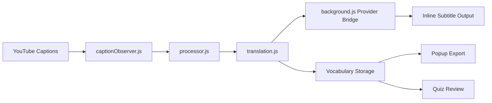

  # Lingo Stream

  **Learn vocabulary from YouTube captions without leaving the video.**

  Lingo Stream is a Chrome extension that adds inline word translations to YouTube subtitles, helping you build vocabulary through repeated exposure while keeping the original caption readable.
</div>

<p align="center">
  
  
  
  
  
</p>

<p align="center">
  <a href="#overview">Overview</a> •
  <a href="#how-it-works">How It Works</a> •
  <a href="#features">Features</a> •
  <a href="#download-and-install">Install</a> •
  <a href="#usage">Usage</a> •
  <a href="#providers-and-languages">Providers & Languages</a> •
  <a href="#development">Development</a> •
  <a href="#testing">Testing</a> •
  <a href="#limitations">Limitations</a> •
  <a href="#privacy">Privacy</a> •
  <a href="#roadmap">Roadmap</a> •
  <a href="#contributors">Contributors</a> •
  <a href="#contributing">Contributing</a> •
  <a href="#license">License</a>
</p>

---

## Overview

Lingo Stream turns passive subtitle watching into lightweight vocabulary practice.

Instead of translating entire captions, it adds inline translations to a small percentage of meaningful words. That keeps the sentence readable while gradually reinforcing vocabulary in context.

### Example

```text
Original: I really enjoy learning new skills every day.
Lingo Stream: I really enjoy (gusto) learning new skills every day.
```

> Design principle: do not translate everything. Preserve context first, then reinforce vocabulary through repetition.

---

## How It Works

1. Lingo Stream watches YouTube captions in real time.
2. It filters out low-value tokens such as stopwords, numbers, and very short words.
3. It selects a configurable percentage of useful words.
4. It fetches translations through one of several providers.
5. It inserts the translated word inline while keeping the original subtitle flow intact.
6. It can optionally save vocabulary for later review and quiz practice.

---

## Features

- Real-time subtitle observation on YouTube
- Inline word translations instead of full-caption replacement
- Adjustable translation percentage
- Token filtering to avoid low-value words
- Provider fallback in `auto` mode
- Translation hit/miss caching to reduce repeated requests
- Optional vocabulary saving
- CSV export for saved vocabulary
- Quiz mode for active recall practice
- Popup diagnostics and health checks
- Interface language selector for the popup and quiz UI

---

## Download and Install

### Option 1: Install the release build

Download the latest packaged release:

- **v1.0.0**: [Lingo.Stream.1.0.0.Release.zip](https://github.com/UnoxyRich/Lingo-Stream/releases/download/Full-Release/Lingo.Stream.1.0.0.Release.zip)

Then:

1. Download and unzip the release.
2. Open Chrome and go to `chrome://extensions`.
3. Enable **Developer mode**.
4. Click **Load unpacked**.
5. Select the unzipped extension folder.

### Option 2: Build from source

#### Prerequisites

- Node.js
- npm
- Google Chrome or another Chromium-based browser with extension loading support

#### Steps

```bash
npm install
npm run build
```

Then:

1. Open `chrome://extensions`
2. Enable **Developer mode**
3. Click **Load unpacked**
4. Select the extension folder you intend to load

> Make sure the folder you load is the actual runtime extension directory for your build output. If your project builds directly into `extension/`, load that folder. If it builds somewhere else, load the built extension output instead.

---

## Usage

1. Open a YouTube video with captions enabled.
2. Open the Lingo Stream popup.
3. Choose your translation provider, target language, and translation percentage.
4. Optionally enable adaptive difficulty.
5. Save settings.
6. Refresh the page or captions if needed.
7. Watch as inline translations appear inside subtitles.
8. Export saved vocabulary as CSV or review it in Quiz mode.
9. To change the popup and quiz language, go to **Settings → Interface Language** and save your choice.

---

## Screenshots

Add screenshots here if you have them. A strong setup is:

- popup settings screen
- subtitle example on YouTube
- quiz mode screen

Example placeholder:

```md


```

---

## Architecture

### Feature Flow



### High-Level Responsibilities

- **Content runtime**: watches caption changes and applies inline translations
- **Processor logic**: filters and selects words for translation
- **Background flow**: handles provider communication and fallback behavior
- **Popup UI**: manages settings, diagnostics, export, and quiz access
- **Vocabulary system**: stores optional review data for later practice

---

## Technical Approach

### Tech Stack

- JavaScript
- HTML
- CSS
- Node.js
- Vitest
- ESLint
- Astro
- Tailwind
- Vite
- Chrome Extension Manifest V3

### Engineering Focus

Lingo Stream was built around reliability and clarity rather than full-sentence translation. The key priorities were:

- keeping captions readable
- avoiding over-translation
- handling unreliable public translation services
- maintaining modular extension logic
- supporting review through saved vocabulary and quiz flow

---

## Providers and Languages

### Translation Providers

Lingo Stream currently supports:

- Google endpoint (`translate.googleapis.com`)
- LibreTranslate public mirrors
- Apertium APY
- MyMemory
- `auto` mode, where the first successful provider wins

> Provider availability, quality, and latency can vary. Public translation services may throttle requests or go offline temporarily.

### Supported Languages

The extension includes a large set of target languages for translation. Support may vary depending on the selected provider.

Examples include:

- Afrikaans (`af`)
- Arabic (`ar`)
- Bengali (`bn`)
- Chinese (`zh`)
- Dutch (`nl`)
- English (`en`)
- French (`fr`)
- German (`de`)
- Hindi (`hi`)
- Indonesian (`id`)
- Italian (`it`)
- Japanese (`ja`)
- Korean (`ko`)
- Polish (`pl`)
- Portuguese (`pt`)
- Russian (`ru`)
- Spanish (`es`)
- Swedish (`sv`)
- Thai (`th`)
- Turkish (`tr`)
- Ukrainian (`uk`)
- Vietnamese (`vi`)
- Yoruba (`yo`)
- Zulu (`zu`)

You can keep the full language list in a separate section or move it into a docs page if you want the README to stay compact.

### Interface Language

The popup and quiz UI can also be displayed in multiple interface languages.

Go to:

**Settings → Interface Language**

Then choose a language and click **Save Settings**.

Full UI translations are currently provided for:

- English
- Spanish
- French
- German
- Chinese
- Japanese
- Korean
- Portuguese
- Russian
- Arabic
- Italian
- Hindi
- Dutch
- Polish
- Turkish
- Vietnamese
- Indonesian
- Ukrainian
- Swedish

Other interface languages fall back to English.

---

## Development

### Scripts

```bash
npm run lint
npm test
npm run test:e2e:smoke
npm run test:coverage
npm run validate:manifest
npm run build
npm run ci
```

### Project Structure

```text
extension/   Runtime extension files
tests/       Unit, integration, and e2e tests
scripts/     Build and validation helpers
docs/        Project documentation site assets
```

---

## Testing

Current automated coverage includes:

- processor and stopword logic
- translation bridge and background behavior
- content bundle compatibility
- caption mutation integration flows

### Run tests

```bash
npm test
```

### Recommended checks before shipping

```bash
npm run lint
npm test
npm run validate:manifest
npm run build
```

---

## Limitations

- Public translation providers may rate-limit or fail temporarily
- Translation quality depends on third-party services
- Language coverage can differ by provider
- The extension is designed for inline vocabulary reinforcement, not full sentence rewriting
- Behavior depends on YouTube captions being available and detectable

---

## Privacy

Lingo Stream stores data in Chrome storage:

- **Settings**: `chrome.storage.sync`
- **Debug metadata and optional vocabulary**: `chrome.storage.local`

### Important notes

- No API key is required for the default provider flow
- Translation requests may be sent to third-party translation providers
- Provider reliability and privacy practices are outside the extension’s control
- Optional vocabulary storage is local to the extension unless you explicitly export it

If you want this section to be stronger, add a small permissions table and explicitly document:

- what text is sent to translation providers
- which permissions are requested
- whether browsing history is stored
- whether exported vocabulary leaves the browser automatically

---

## Current Status

Implemented today:

- core extension runtime
- popup settings and health diagnostics
- vocabulary tracking and CSV export
- quiz review mode
- lint, test, and build workflows

---

## Roadmap

- smarter retry and backoff behavior for translation providers
- clearer failure diagnostics in the popup
- better vocabulary browsing and filtering
- improved onboarding and first-run guidance
- richer analytics for learning progress

---

## Contributors

| Team Member | Focus Area |
| --- | --- |
| Justin-Yonardo | Team leadership, primary engineering, core logic |
| UnoxyRich | UI design, video editing, communication materials, repo organization, CI/readme work |
| LeoLiu32 | UI implementation and interaction work |

---

## Contributing

Focused improvements and bug fixes are welcome.

1. Fork the repository
2. Create a feature branch
3. Keep changes scoped
4. Run lint and tests locally
5. Open a pull request with screenshots or behavior notes for UI changes

### Suggested pre-PR checks

```bash
npm run lint
npm test
npm run validate:manifest
```

---

## License

Add your project license here.

Example:

```md
This project is licensed under the MIT License.
```
