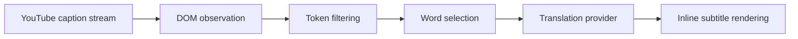

# Lingo Stream

<p align="center">
  
</p>

<p align="center"><strong>Ambient language learning inside YouTube subtitles.</strong></p>

<p align="center">
  
  
  
  
</p>

Lingo Stream turns passive video time into active vocabulary growth. The extension watches live captions on YouTube, selects high-value words, and injects short contextual translations inline so the viewer keeps following the video without opening another app.

Example subtitle flow:

```text
Original: I really enjoy learning new skills every day.
Lingo Stream: I really enjoy (gusto) learning new skills every day.
```

## Why It Matters

YouTube reaches more than 2.7 billion monthly users, yet most language tools still require context switching that breaks attention. Lingo Stream removes that friction and keeps learning in the same place where entertainment already happens, which increases consistency and makes vocabulary practice feel natural.

## Product Snapshot

| Area | Current Direction |
| --- | --- |
| Core value | Learn vocabulary through contextual micro-immersion while watching normal videos |
| Primary surface | Chrome Extension popup and content-script subtitle rendering |
| Translation strategy | Controlled word-level replacement instead of full-sentence translation |
| User control | Configurable immersion intensity and target language |
| Learning loop | Watch, absorb in context, review over repeated exposure |

## How It Works



The runtime is designed to stay lightweight and readable by only replacing a small fraction of words at a time, typically in the 5% to 20% range, so sentence meaning remains clear while exposure grows over time.

## Interface Preview

<p align="center">
  
</p>

<p align="center">
  
</p>

## Repository Status

This repository currently contains design assets, UI explorations, and branding files for the HackMIT China 2026 submission phase. The production extension logic and API wiring are in active implementation.

## Tech Direction

| Layer | Planned Implementation |
| --- | --- |
| Extension shell | Manifest V3 plus content scripts |
| Subtitle capture | MutationObserver on live caption nodes |
| Translation sources | LibreTranslate, Google-compatible endpoint, or MyMemory |
| UI | Lightweight popup controls for immersion settings |
| Performance | Caching and request batching to reduce latency |

## Vision

Lingo Stream aims to make every YouTube video a low-friction language classroom. Instead of asking people to pause their routine and start a separate study session, it lets learning happen during content they already watch every day.
